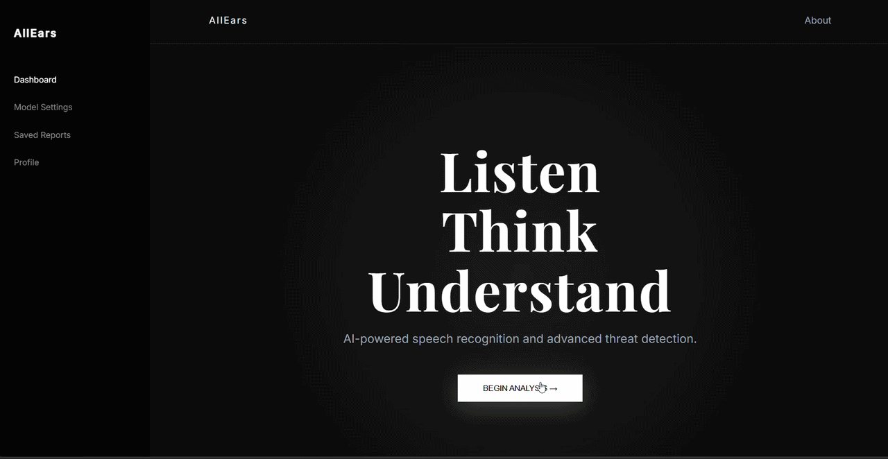

# 🎧 AllEars – AI Audio Intelligence System

An AI-powered audio analysis system that performs **speech transcription**, **sound event detection**, and **context-aware interpretation** using modern deep learning models.

---

## 🚀 Features

* 🎤 **Speech-to-Text Transcription**

  * Powered by Whisper for accurate transcription

* 🔊 **Sound Event Detection**

  * Uses YAMNet to identify environmental sounds

* 🧠 **Contextual Understanding**

  * Transformers + Ollama for intelligent interpretation

* 🌐 **Web Interface**

  * Built with Flask for easy interaction

---

## 🛠️ Tech Stack

* Python
* Flask
* OpenAI Whisper
* TensorFlow / YAMNet
* Transformers
* Ollama

---

## 📂 Project Structure

```
AllEars/
│── app.py
│── templates/
│── static/
│── models/
│── utils/
│── requirements.txt
```

---

## ⚙️ Installation & Setup

1. Clone the repository:

```
git clone https://github.com/harshvardhansingh3010/AllEars.git
cd AllEars
```

2. Install dependencies:

```
pip install -r requirements.txt
```

3. Run the application:

```
python app.py
```

4. Open in browser:

```
http://127.0.0.1:5000
```

---

## 📸 Demo




---

## 💡 Future Improvements

* Real-time audio streaming
* Mobile app integration
* Better UI/UX
* Multi-language support

---

## 👨‍💻 Author

Harsh Vardhan Singh

---

## ⭐ Show your support

If you like this project, give it a ⭐ on GitHub!

